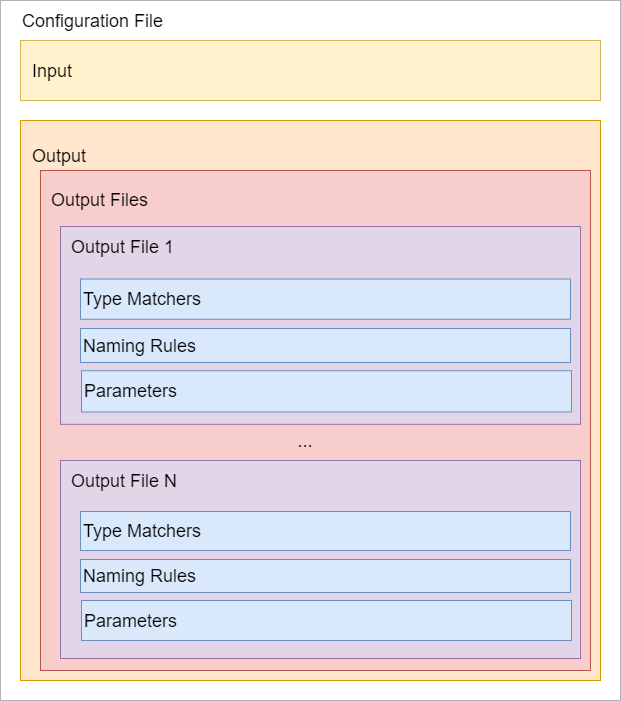

# Paradigm.CodeGen
Code generation / scaffolding tool making extensive use of razor as templating language.
Codegen is fully configurable and pluginable, and can produce output in any language.
Currenly is being used by the [Paradigm.ORM](https://github.com/MiracleDevs/Paradigm.ORM.git)
to generate dbfirst classes, and to generate typescript services and model for the Paradigm.AngularJS
and Paradigm.Angular wrappers.

How it works
---

Codegen transforms a given input into an intermediate model (IM), and then use that IM to feed a template system. Both input and output are plugins, so more inputs and outputs can be added later.

The codegen tool comes with two input methods out of the box:
- **.NET CORE Assemblies:** Codegen will look into the assembly, and extract object information using reflection. From there, it will create the IM. This input method is ideal to transform domain objects to other languages, or for example, to produce proxy service and models for a client application, feeding the webapi o wcf service application.
- **JSON object models:**  Codegen receives a JSON file containing object information. The JSON requires a certain format, that it's provided by a [nuget package](https://www.nuget.org/packages/Paradigm.CodeGen.Input.Json.Models/). Codegen transform the JSON file to its IM.

> Working with .NET is ideal, because Codegen can open and extract types (codegen intermediate model) directly from the assemblies.
> But if you are using another language (Java, Object-c, typescript, javascript, etc) you
can still take advantage of the tool by providing a json file with object definitions.

Once the IM is created, the output plugin is created, and the output service is fed with the IM. Right now there is only one output plugin:
- **Razor output service**: It takes the IM and generates an output file in any language desired. Also, Codegen applies some non-official functionalities like the @include operator to include other files, or the possibility of work with c# static classes that codegen will translate into @functions sentence.

Process Workflow
---
As we mentioned, codegen works with input and output plugins, and thus needs to be properly configured in order to work. Let's assume we have a configuration with a .net assembly input, and using the default output:

1. First, the assembly is opened and reflection is used to extract the IM.
The IM is basically a list of object definitions.
2. Once the list is ready, codegen applies type matching rules (previously set in the configuration file) and select some of the objects in the IM list.
3. The selected objects are feed to the output service.
4. A razor template (also configured) is opened, the IM object is set as the razor model and the output file is generated.
5. Naming rules are then applied (also configured) to name the output file.
6. The files are then stored on the desired location.

Configuration File Structure
---
The most time demanding task when using codegen, is to create the configuration file, due its complexity. Once the file is made tho, it can be normally copied and renamed, and won't be much of an issue going forward. Also, it will really improve development times down the road.

As the diagram above shows, there are two main configuration section, the input configuration, and the output configuration. In both, the user must provide the plugin configuration.
The output is really where the complexity resides. The output configuration is made of a list of output files, and each output file, describe which template to use, how objects will be matched (Type Matchers), how the file will be named (Naming rules) and defines custom parameters that codegen will provide to the output service to be used as custom user information.
You can see a couple of configuration examples [here](examples/configuration/typescript.webapi.json) and [here](examples/configuration/csharp.orm.json)

Nuget Packages
---

| Library | Nuget | Install
|-|-|-|
| Paradigm.CodeGen.Input.Json.Models |  | `Install-Package Paradigm.CodeGen.Input.Json.Models` |

Self Contained Deploy (SCD)
---

Bellow you can find portable versions for all major OSs.
If you are planning to use codegen in several projects, we recommend to add the SCD folder to your PATH.

| OS | Zip File |
|-|-|
| Windows x86 | [Download](https://raw.githubusercontent.com/MiracleDevs/Paradigm.CodeGen/master/dist/codegen.win-x86.zip) |
| Windows x64 | [Download](https://raw.githubusercontent.com/MiracleDevs/Paradigm.CodeGen/master/dist/codegen.win-x64.zip) |
| Linux x64   | [Download](https://raw.githubusercontent.com/MiracleDevs/Paradigm.CodeGen/master/dist/codegen.linux-x64.zip) |
| OSX x64     | [Download](https://raw.githubusercontent.com/MiracleDevs/Paradigm.CodeGen/master/dist/codegen.osx-x64.zip) |

Command Line Arguments

| Short Version | Large Version | Default Value | Description |
|-|-|-|-|
| `-f`       | `--filename <filename>`              |       | Indicates the path of one or more output configuration files.
| `-d`       | `--directory <directory>`            |       | Indicates the path of one or more directories containing the output configuration files.
| `-t`       | `--top-directory`                    | false | If directories were provided, indicates if the system should check only on the top directory.
| `-e`       | `--extension <extension>`            | json  | Indicates the extension of configuration files when searching inside directories.
| `-mp`      | `--max-parallelism <amount-of-cores>`| 4     | Indicates the number of parallel tasks allowed.
| `-o`       | `--override <outputFile>:<typeName>` |       | Allows to override the configuration file and choose an Output File Configuration for a given Type Name. Please consider that any other configuration won't be executed if you override the configuration file.
| `-?`  `-h` | `--help`                             |       | Show help information

Change log
---

Version `2.1.0`
- Updated nuget dependencies.
- Updated projects to .NET 5.0 and Standard 2.1.0.

Version `2.0.3`
- Updated nuget dependencies.
- Modified the output service to run the code generation in parallel.
- Added a new parameter to indicate the maximum amount of parallel tasks.

Version `2.0.2`
- Updated Razor Light to an alpha version supporting .NET Core 2.0 and 2.0 standard libraries.
- Updated templates.

Version `2.0.1`
- Updated Paradigm.Core to version `2.0.1`.

Version `2.0.0`
- Updated .net core from version 1 to version 2.

Version `1.0.0`
- Uploaded first version of the Paradigm CodeGen.
